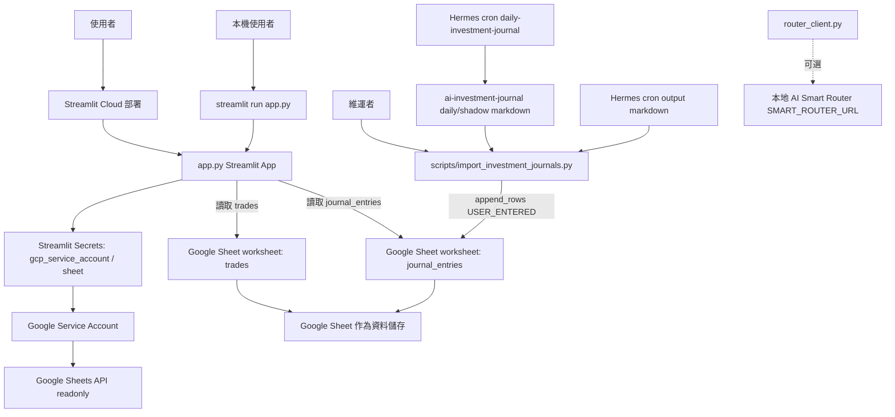
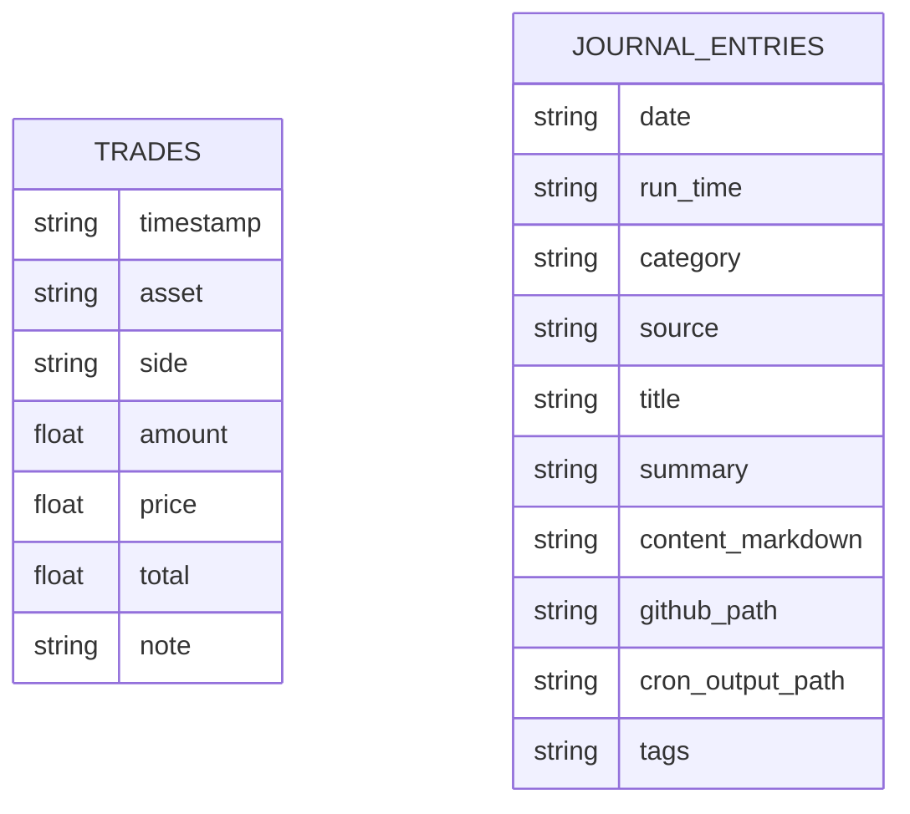

# 系統架構

## 專案總覽

Crypto Diary / 投資日記是一個 Streamlit + Google Sheets 的唯讀投資日記儀表板。它把加密貨幣、ETF、其他投資交易，以及每日排程產生的投資決策日記集中展示，適合需要查閱投資紀錄、每日策略輸出與分類概覽的個人投資者或維運者。網頁端不提供寫入功能；交易與日記資料由 Google Sheet、外部排程或匯入腳本寫入。

## 技術棧

| 類別 | 實際使用 | 來源 | 用途 |
|---|---|---|---|
| UI 框架 | Streamlit | `requirements.txt`, `app.py` | 建立單頁互動式儀表板、sidebar、tabs、metrics、charts |
| 語言 | Python | `.py` 原始碼 | 應用與維運腳本 |
| 資料處理 | pandas | `requirements.txt`, `app.py` | 整理交易、日期、分類、彙總與圖表資料 |
| Google Sheets client | gspread | `requirements.txt`, `app.py`, `scripts/import_investment_journals.py` | 讀取與寫入 Google Sheet worksheet |
| Google Auth | google-auth | `requirements.txt`, `app.py`, `scripts/import_investment_journals.py` | 使用 Service Account 授權 Google Sheets / Drive |
| 資料儲存 | Google Sheets | `README.md`, `app.py` | `trades` 與 `journal_entries` worksheet 作為 canonical store |
| 部署 | Streamlit Cloud | `README.md` | 對外部署 Streamlit app |
| 外部排程 | Hermes cron `daily-investment-journal` | `README.md`, 匯入腳本欄位 | 產生每日投資日記並同步到 Sheet |
| 輔助 HTTP client | httpx | `router_client.py` | 呼叫本地 AI Smart Router；目前主 `app.py` 未引用，且 `requirements.txt` 未列出 |

## 架構圖

## 主要目錄結構

| 路徑 | 用途 |
|---|---|
| `app.py` | Streamlit 主程式。讀取 Google Sheets，渲染投資日記 dashboard、日記閱讀器、交易紀錄與寫入說明。 |
| `router_client.py` | 本地 AI Smart Router 的薄 client，提供 `_pick_model()` 與 `chat()`；目前沒有被 `app.py` 匯入。 |
| `scripts/import_investment_journals.py` | 維運匯入腳本。掃描本機 markdown 日記與 Hermes cron output，去重後寫入 `journal_entries`。 |
| `requirements.txt` | Python runtime 依賴。 |
| `README.md` | 專案入口說明、Live App、schema、開發與安全資訊。 |
| `docs/` | 本次建立的技術文件。 |

## 資料模型概覽

資料模型位於 Google Sheet worksheet，repo 沒有 Prisma schema、SQL migration 或 ORM model。`app.py` 定義 `TRADE_HEADER` 與 `JOURNAL_HEADER`；匯入腳本也以相同 `journal_entries` header 寫入。

兩個 worksheet 目前沒有外鍵或程式層關聯。`app.py` 只用 `category` 篩選與彙總；`trades.asset` 會透過 `classify_asset()` 對應到 `Crypto`、`ETF` 或 `其他`。
