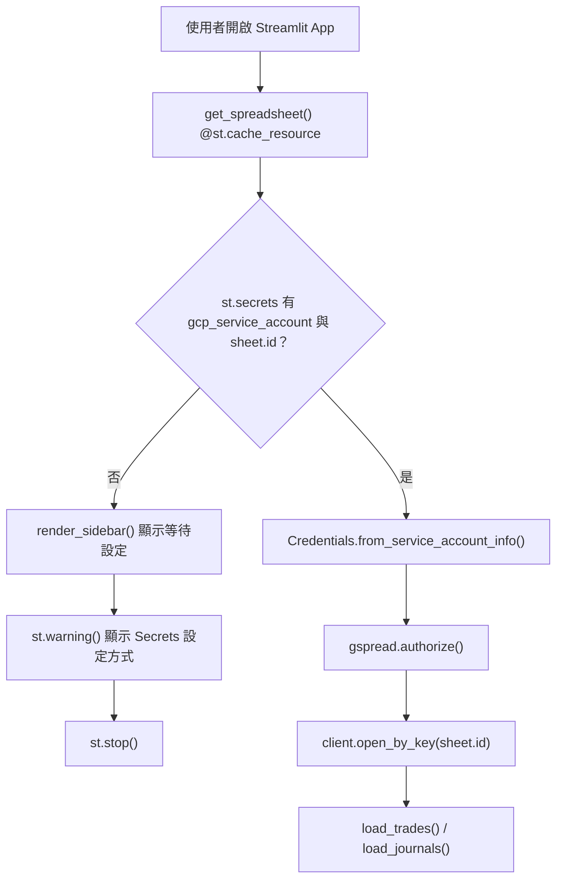
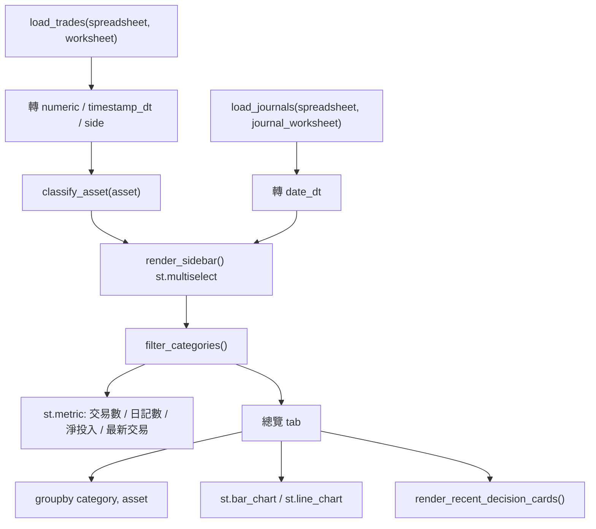
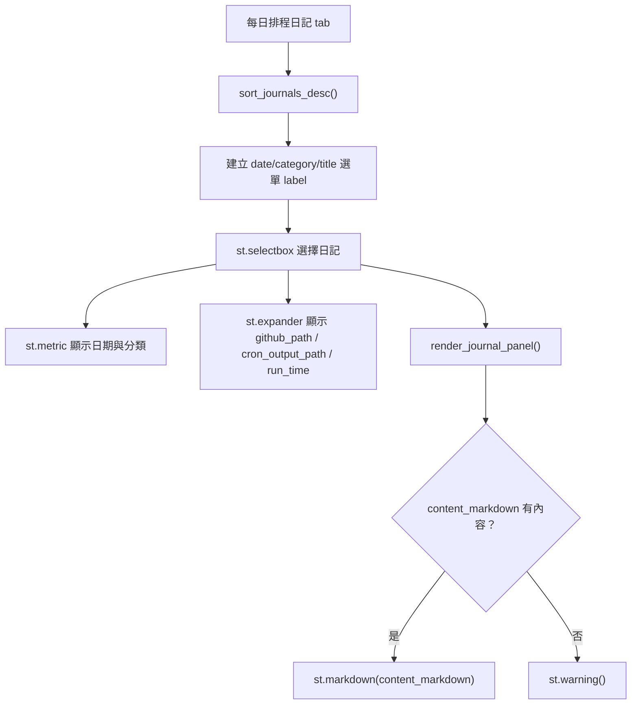
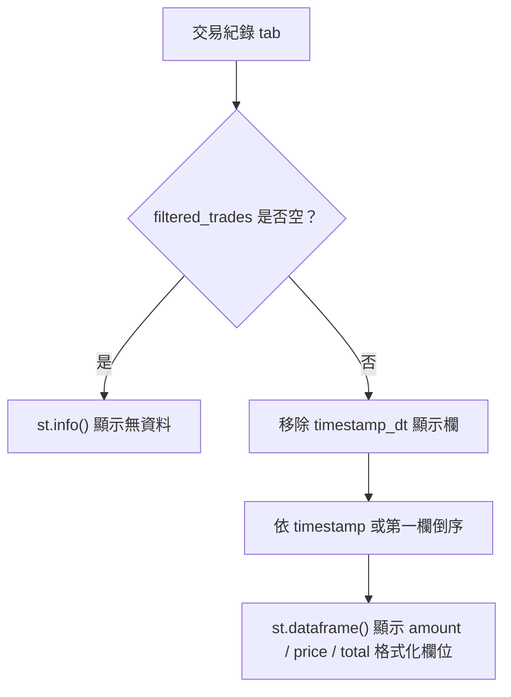
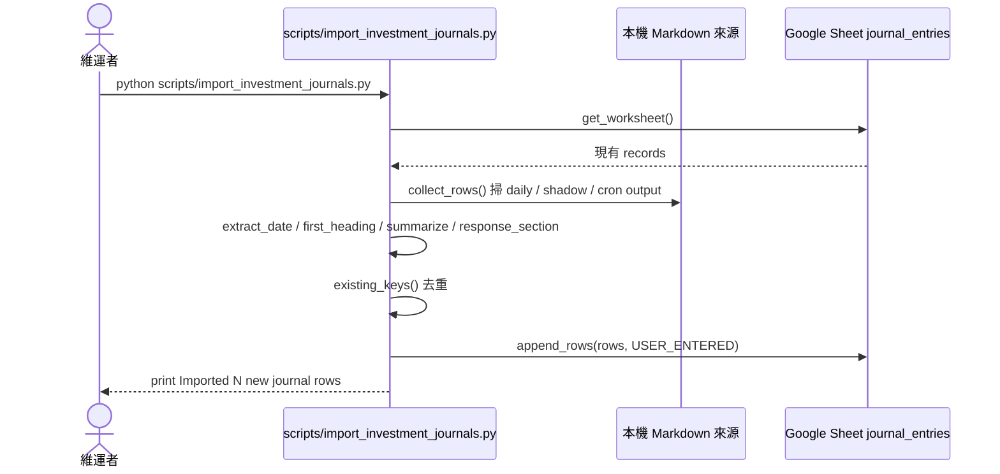

# 操作與業務流程

## 1. Streamlit 啟動與 Google Sheets 連線

`app.py` 先檢查 Streamlit Secrets，再用 Google Service Account 建立 readonly 連線。缺少 secrets 時不載入資料，直接顯示設定說明並停止頁面流程。

## 2. Dashboard 分類篩選與總覽彙總

總覽依 sidebar 選取分類過濾交易與日記。交易會依資產代號分類並計算持有量、淨現金流、分類買賣金額與每日淨現金流。

## 3. 每日排程日記閱讀

日記頁只讀取 `journal_entries`。使用者可從下拉選單切換日記，查看摘要、metadata 與完整 Markdown 內容。

## 4. 完整交易紀錄檢視

交易紀錄頁顯示 Google Sheet `trades` 的完整資料。程式只做格式化、排序與欄位顯示，不提供新增或更新交易的 UI。

## 5. 歷史投資日記匯入

匯入腳本是本機維運工具，會用可寫入的 Google Sheets / Drive scopes。它只寫入 `journal_entries`，並用 `(date, source, github_path, cron_output_path)` 避免重複匯入。
