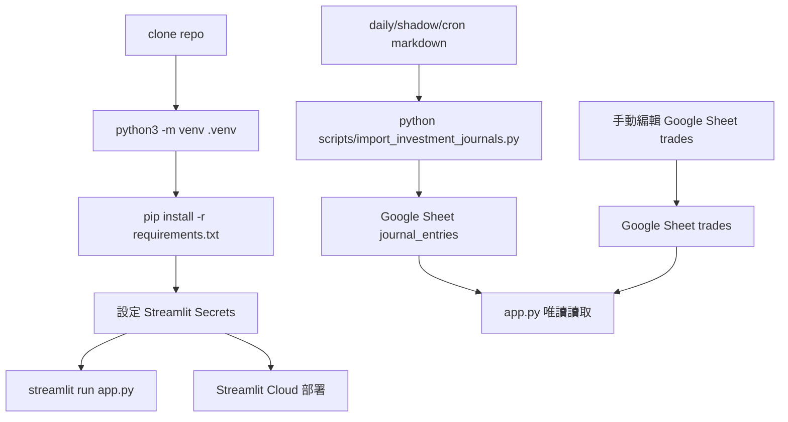

# 安裝、執行、部署、維運

## 維運總覽



## 環境需求

| 項目 | 需求 |
|---|---|
| Python | repo 沒有版本鎖定檔；既有 README 使用 `python3`。 |
| 套件管理 | `pip` + `requirements.txt`。 |
| Google Cloud | 需要 Service Account JSON 內容或本機憑證檔。 |
| Google Sheet | 需要至少 `trades` worksheet；日記功能使用 `journal_entries` worksheet。 |
| Streamlit | 本機用 `streamlit run app.py`；部署用 Streamlit Cloud。 |

repo 未找到 `package.json`、`Makefile`、`Dockerfile`、`docker-compose.yml`、Prisma schema 或 SQL migration。

## 安裝與本機啟動

```bash
git clone https://github.com/wsx5031060310guy/crypto-diary.git
cd crypto-diary
python3 -m venv .venv
source .venv/bin/activate
pip install -r requirements.txt
streamlit run app.py
```

本機執行前需建立 `.streamlit/secrets.toml`，內容格式同 Streamlit Cloud Secrets。不要把 secrets 檔 commit。

## Streamlit Secrets

`app.py` 讀取 `st.secrets`，不是 `process.env` 或 `.env`。必要 secrets：

| 區塊 / key | 用途 | 是否敏感 |
|---|---|---|
| `[gcp_service_account]` | Google Service Account JSON 內容。 | 是 |
| `type` | Service Account 類型。 | 否 |
| `project_id` | Google Cloud project id。 | 視情況 |
| `private_key_id` | private key id。 | 是 |
| `private_key` | private key。 | 是 |
| `client_email` | Service Account email，需要被加入 Google Sheet 權限。 | 視情況 |
| `client_id` | Service Account client id。 | 視情況 |
| `auth_uri` | Google OAuth auth URI。 | 否 |
| `token_uri` | Google OAuth token URI。 | 否 |
| `auth_provider_x509_cert_url` | Google cert URL。 | 否 |
| `client_x509_cert_url` | Service Account cert URL。 | 視情況 |
| `universe_domain` | Google API domain。 | 否 |
| `[sheet].id` | Google Sheet ID。 | 視情況；不要公開到不受信任環境。 |
| `[sheet].worksheet` | 交易 worksheet 名稱；預設 `trades`。 | 否 |
| `[sheet].journal_worksheet` | 日記 worksheet 名稱；預設 `journal_entries`。 | 否 |

## 環境變數

repo 未找到 `.env.example`。程式碼讀取的環境變數如下；不要在文件或版本庫寫入真實憑證值。

| 變數 | 程式位置 | 用途 | 必要性 |
|---|---|---|---|
| `CRYPTO_BOT_SHEET_ID` | `scripts/import_investment_journals.py` | 匯入腳本要寫入的 Google Sheet ID。 | 匯入腳本建議設定；未設定時使用程式碼預設值。 |
| `CRYPTO_BOT_GCP_CRED` | `scripts/import_investment_journals.py` | 本機 Service Account JSON 檔路徑。 | 匯入腳本需要可讀的憑證檔。 |
| `CRYPTO_BOT_JOURNAL_WORKSHEET` | `scripts/import_investment_journals.py` | 匯入目標 worksheet；預設 `journal_entries`。 | 可選 |
| `AI_INVESTMENT_JOURNAL_DIR` | `scripts/import_investment_journals.py` | `daily/` 與 `shadow/` markdown 日記來源根目錄。 | 可選 |
| `HERMES_INVESTMENT_CRON_OUTPUT` | `scripts/import_investment_journals.py` | Hermes cron output markdown 來源目錄。 | 可選 |
| `SMART_ROUTER_URL` | `router_client.py` | 本地 AI Smart Router base URL；預設 `http://127.0.0.1:8765`。 | 只有使用 `router_client.py` 時需要 |

## 部署方式

既有 README 標示部署於 Streamlit Cloud：

- `https://crypto-diary-bvprx9psuxdvbuyrmohhgr.streamlit.app/`

部署需要：

1. Streamlit Cloud 指向此 repo。
2. App 入口使用 `app.py`。
3. 在 Streamlit Cloud App Settings → Secrets 設定 `[gcp_service_account]` 與 `[sheet]`。
4. Google Sheet 需把 Service Account email 加入讀取權限；若匯入腳本要寫入，該憑證需有寫入權限。

repo 沒有 Docker 或其他部署設定檔。

## 常見維運操作

### 匯入每日排程歷史紀錄

```bash
python scripts/import_investment_journals.py
```

在既有 README 記錄的 Mike Hermes 環境，可使用既有 crypto bot venv：

```bash
/Users/mike-hermes-ai/.hermes/crypto_bot/venv/bin/python \
  /Users/mike-hermes-ai/projects/crypto-diary/scripts/import_investment_journals.py
```

腳本會：

1. 讀取目標 Google Sheet 的 `journal_entries`。
2. 若 worksheet 不存在就建立並寫入 header。
3. 掃描 `daily/*.md`、`shadow/*.md` 與 Hermes cron output `20*.md`。
4. 用 `(date, source, github_path, cron_output_path)` 去重。
5. 將新資料用 `append_rows(..., value_input_option="USER_ENTERED")` 寫入。

### 資料表維護

`trades` 欄位：

```text
timestamp, asset, side, amount, price, total, note
```

`journal_entries` 欄位：

```text
date, run_time, category, source, title, summary, content_markdown, github_path, cron_output_path, tags
```

`app.py` 不會建立或修改 worksheet。`scripts/import_investment_journals.py` 只會建立 / 補 header 給 `journal_entries`，且遇到既有 header 不符會 raise `ValueError`。

### Migration、seed、cron、備份

| 操作 | 現況 |
|---|---|
| Migration | 無 migration 系統；schema 是 Google Sheet header。 |
| Seed | 無 seed 腳本。 |
| Cron | repo 沒有 cron 設定檔；既有 README 描述外部 Hermes cron `daily-investment-journal` 每天 09:00 產生日記。 |
| 備份 | repo 沒有備份腳本；可用 Google Sheets 版本記錄或手動匯出。 |
| 快取 | `load_trades()` 與 `load_journals()` 使用 `@st.cache_data(ttl=300)`；資料變更後最多可能延遲 5 分鐘反映。 |
