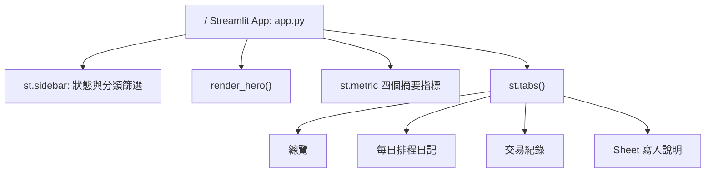

# 頁面、路由與模組清單

## Streamlit 頁面結構

這個 repo 沒有 Flask、FastAPI、Next.js、Django 或自訂 HTTP routes。Web 介面是單一 `app.py` Streamlit app；頁面切換由 `st.tabs()` 完成，不是獨立 URL route。

| 路徑 / 頁面 | 程式位置 | 用途 | 是否需登入 |
|---|---|---|---|
| `/` | `app.py` | Streamlit 單頁儀表板入口。載入 Google Sheet 後顯示 hero、摘要 metrics、sidebar 與 tabs。 | 否。程式碼沒有使用者登入判斷；資料連線由 Service Account secrets 控制。 |
| `總覽` tab | `app.py` `with tab_overview:` | 顯示分類資產彙總、分類買賣金額、每日淨現金流、最近排程決策。 | 否 |
| `每日排程日記` tab | `app.py` `with tab_journals:` | 用下拉選單閱讀 `journal_entries` 的日記、metadata 與 `content_markdown`。 | 否 |
| `交易紀錄` tab | `app.py` `with tab_trades:` | 顯示 `trades` worksheet 的完整交易資料。 | 否 |
| `Sheet 寫入說明` tab | `app.py` `with tab_sheet:` | 說明網頁唯讀、手動修改需在 Google Sheet 操作、列出 `journal_entries` 欄位。 | 否 |

## 自訂 API Endpoint

| 方法 | 路徑 | 用途 | 狀態 |
|---|---|---|---|
| 無 | 無 | repo 沒有實作對外 HTTP API endpoint。Streamlit runtime 會處理頁面服務，但不是本 repo 自訂 route。 | 不適用 |

## 外部 API 呼叫與輔助 Client

| 方法 | 目標 | 程式位置 | 用途 | 備註 |
|---|---|---|---|---|
| Google Sheets API | `client.open_by_key()`, `spreadsheet.worksheet()`, `worksheet.get_all_records()` | `app.py` | 唯讀載入 `trades` 與 `journal_entries`。 | 使用 `https://www.googleapis.com/auth/spreadsheets.readonly` scope。 |
| Google Sheets API | `worksheet.append_rows()` | `scripts/import_investment_journals.py` | 匯入 markdown 日記到 `journal_entries`。 | 使用 `spreadsheets` 與 `drive` scopes。 |
| `GET` | `${SMART_ROUTER_URL}/route` | `router_client.py` `_pick_model()` | 依 tier 選擇模型。 | 主 `app.py` 未引用。 |
| `POST` | `${SMART_ROUTER_URL}/v1/chat/completions` | `router_client.py` `chat()` | 將 messages 送到本地 AI Smart Router。 | 主 `app.py` 未引用；`httpx` 未列在 `requirements.txt`。 |

## 主要模組與函式

| 模組 / 函式 | 用途 |
|---|---|
| `app.py:get_spreadsheet()` | 讀取 Streamlit Secrets，建立 Google Sheets readonly 連線。 |
| `app.py:_worksheet_records()` | 讀取 worksheet records；worksheet 不存在或空資料時回傳空 DataFrame。 |
| `app.py:load_trades()` | 載入交易，轉換數字欄位、時間欄位、資產代號與分類。 |
| `app.py:load_journals()` | 載入日記，轉換日期欄位並補齊 header 欄位。 |
| `app.py:classify_asset()` | 將資產代號分為 `Crypto`、`ETF` 或 `其他`。 |
| `app.py:filter_categories()` | 依 sidebar 多選分類過濾交易與日記。 |
| `app.py:render_sidebar()` | 顯示狀態、worksheet 名稱與分類篩選。 |
| `app.py:render_hero()` | 顯示儀表板主標題與資料狀態。 |
| `app.py:render_recent_decision_cards()` | 顯示最近排程決策卡片。 |
| `scripts/import_investment_journals.py:collect_rows()` | 掃描 daily、shadow、cron output markdown 並轉為 `JournalRow`。 |
| `scripts/import_investment_journals.py:existing_keys()` | 讀取已存在紀錄並產生去重 key。 |
| `scripts/import_investment_journals.py:main()` | 執行匯入、去重與 append rows。 |
| `router_client.py:chat()` | 呼叫本地 AI Smart Router chat completions endpoint。 |
